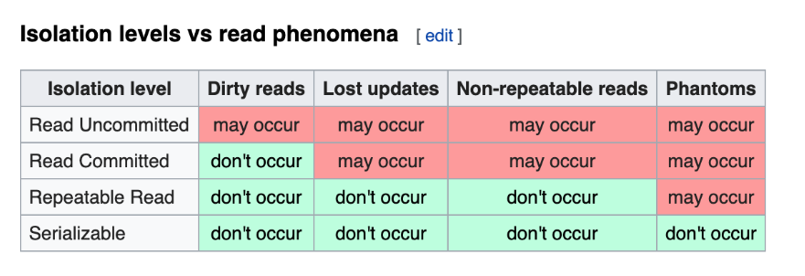

# Database Engines Crash Course
## Intro
### Docker notes
When you spin up a docker container named "pg" for example, you can connect to it that in two methods

1) Expose the port to your host machine as I do in all the examples in this course. E.g  For example if I run my container with the option -p 5555:80 this exposes port 80 in the container to your host machine. For instance, my host machine is husseinmac, I can access the container using husseinmac:5555

2) Access the docker container IP directly. This doesn't work on mac but works on other operating systems. You can do "docker inspect pg" to reveal the IP address of the container then connect to it. e.g. 172.17.0.3:80 or 172.17.0.3:5432

## ACID
- Atomicity, Consistency, Isolation and Durability in
Relational Database Systems 
### Transaction
- A collection of queries as one unit of work
- Transaction Lifespan
  - BEGIN
  - COMMIT - persisting everything
  - ROLLBACK
  - Transaction unexpected ending = ROLLBACK (e.g. crash)
- Usually Transactions are used to change and modify data
- We can also use transaction for read only queries. This can be usefull because it gives a consistent snapshot based at the time of transaction.
- We are always in some transacion, either defined by a developer or  by a system

### Atomicity
- Atom cannot be split
- All queries in a transaction must succeed.
- If one query fails, all prior successful queries in the transaction should rollback.
- If the database went down prior to a commit of a transaction, all the successful queries in the transactions should rollback.
### Isolation
- Can my inflight transaction see changes made by other transactions?
#### Read phenomena
- Dirty reads - you can read something that other transaction has not commited yet,
- Non-repeatable reads - 2 reads gives 2 different results, because 2nd transaction commited it's change while our 1st is not finished yet,
- Phantom reads - you can read something that does not exist. 2nd trans. inserts and commits something when our 1st is still processing,
- Lost updates - you wrote something but it dissapears. 2nd tr. updates and overwrites changes made my the 1st tr.


#### Isolation Levels
- Read uncommitted - No Isolation, any change from the outside is visible to the transaction, committed or not. 
- Read committed - Each query in a transaction only sees committed changes by other transactions
- Repeatable Read - The transaction will make sure that when a query reads a row, that row will remain unchanged while its running.
- Snapshot - Each query in a transaction only sees changes that have been committed up to the start of the transaction. It's like a snapshot version of the database at that moment. 
- Serializable - Transactions are run as if they serialized one after the other.  
- Each DBMS implements Isolation level differently. No cuncurrency.



#### Database Implementation of Isolation
- Each DBMS implements Isolation level differently 
- Pessimistic - Row level locks, table locks, page locks to avoid lost updates
- Optimistic - No locks, just track if things changed and fail the transaction if so
- Repeatable read “locks” the rows it reads but it could be expensive if you read a lot of rows, postgress implements RR as snapshot. That is why you don’t get phantom reads with postgres in repeatable read
- Serializable are usually implemented with optimistic concurrency control, you can implement it pessimistically with SELECT FOR UPDATE 
### Consistency
- Consistency in Data - state of the data that is persisted (in a claster, data  instance)
  - Defined by the user
  - Referential integrity (foreign keys)
  - Atomicity
  - Isolation
- Consistency in reads - applies to a system
  - If a transaction committed a change will a new transaction immediately see the change? 
  - Affects the system as a whole
  - Relational and NoSQL databases suffer from this
  - Eventual consistency
  
### Durability
- Changes made by committed transactions must be persisted in a durable non-volatile storage.
- Durability techniques 
  - WAL - Write ahead log (any change-delta goes to wal first)
  - Asynchronous snapshot (saving to the memory and async. saving everything at once to the desktop) 
  - AOF - similar to WAL, can read back in case of crash
#### WAL
- Writing a lot of data to disk is expensive (indexes, data files, columns, rows, etc..)
- That is why DBMSs persist a compressed version of the changes known as WAL (write-ahead-log segments)
#### OS Cache

- A write request in OS usually goes to the OS cache
- When the writes go the OS cache, an OS crash, machine restart could lead to loss of data
- Fsync OS command forces writes to always go to disk
- fsync can be expensive and slows down commits
### ACID example
- postgres docker
```
docker run --name pgacid -d -e POSTGRES_PASSWORD=postgres postgres:13

docker ps
```
- postgres psql console
```
docker exec -it pgacid psql -U postgres
postgres=# create table products (pid serial primary key, name text, price float, inventory integer);

postgres=# create table sales (saleid serial primary key, id integer, price float, quantity integer);

postgres=# insert into products(name, price, inventory) values('Phone', 999.99, 100);

postgres=# select * from products;

postgres=# begin transaction;
BEGIN
postgres=# select * from products;

postgres=# update products set inventory = inventory - 10;

postgres=# select * from products;

postgres=# insert into sales (pid, price, quantity) values(1, 999.99, 10)

postgres=# COMMIT;

# Isolation
postgres=# begin transaction;

postgres=# insert into sales (pid, price, quantity) values(1, 999.99, 10)

postgres=# update products set inventory = inventory - 10 where pid = 1;

postgres=# commit;
```
- Isolation level
```
postgres=# begin transaction isolation level repeatable read;

postgres=# select pid, count(pid) from sales group by pid;

```
```
docker stop pgacid
```
### Phantom Reads
```
postgres=# insert into sales (pid, price, date) values(1, 15, 'feb-7-2021');

postgres=# begin transaction isolation level serializable;

```
- MySql

```
docker container run \
    --name mysql_dummy \
    --publish 3306:3306 \
    --env MYSQL_ROOT_PASSWORD=root \
    --detach \
    mysql:latest


Download the mysql client
https://dev.mysql.com/get/Downloads/MySQL-Shell/mysql-shell-9.1.0-macos14-arm64.dmg


 192.168.7.122 is my  container host
./mysql --host 192.168.7.122 --user root --password=root
```
### Serializable vs Repeatable
#### Example 
- terminal 1
 ```
postgres=# begin transaction isolation level serializable;

postgres=# select * from test;

postgres=# update test set t = 'a' where t = 'b';

postgres=# commit; 

#ERROR: could not serialize access due to read/wtite dependencies..

postgres=# rollback;

postgres=# select * from test;

postgres=# update test set t = 'a' where t = 'b';

postgres=# commit; 
##no errors

 ```
 - terminal 2
 ```
postgres=# begin transaction isolation level serializable;

postgres=# update test set t = 'b' where t = 'a';

commit;
 ```
 ### Eventual Consistency
 - Consistency in data - multiple tables, joins give the correct results
   - Defined by the user
   - Referential integrity
   - Atomicity
   - Isolation
   
 - Consistency in reads - reads return all the changes done before the read query (updates,insterts)
   - If a transaction commited a change will a new transaction immediately see the change?
   - Both Relational and NoSQL databases suffer from this when we want to scale horizontally or introduce caching
   Eventual consistency  